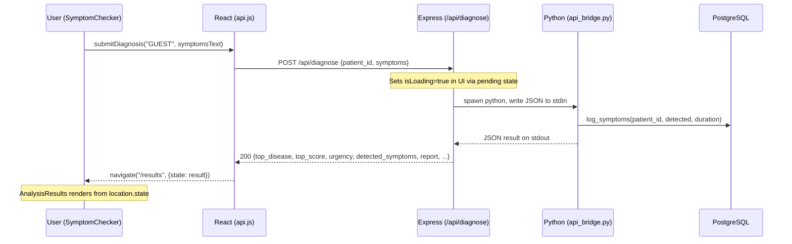
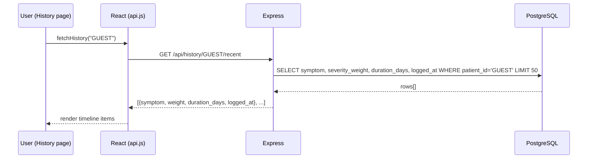

# Design Document: HealthBridge AI Full-Stack Integration

## Overview

This feature ports the static HTML UI templates from `Healthbridge_Ai_UI/` into a fully dynamic React + Express application. The existing codebase already has a working skeleton (routing, Layout, Home, api.js, server.js) — this integration completes the remaining pages (`SymptomChecker`, `AnalysisResults`, `History`, `MedicalHistory`) and wires them to the live Express/Python backend. The result is a cohesive single-page application where every view is driven by real data from the diagnosis pipeline and PostgreSQL history store.

**Open questions resolved for this design:**
- **Authentication**: Use a hardcoded `GUEST` patient ID for this phase. The backend already defaults to `"GUEST"` when no `patient_id` is supplied, so no auth infrastructure is needed now.
- **`clarity_clinical` folder**: The `DESIGN.md` inside is a design-system reference document only — no code to port. Its principles (no-line rule, tonal layering, glassmorphism) are already reflected in `index.css` and `Layout.jsx`. It is excluded from implementation scope.

---

## Architecture

The application follows a three-tier architecture: a Vite/React SPA, an Express API server, and a Python AI bridge backed by PostgreSQL.

```mermaid
graph TD
    subgraph Browser
        A[React SPA<br/>Vite + React Router]
    end

    subgraph Express Server [:5000]
        B[POST /api/diagnose]
        C[GET /api/history/:patient_id]
        D[GET /api/history/:patient_id/recent]
    end

    subgraph Python Layer
        E[api_bridge.py<br/>stdin → stdout JSON]
        F[main.py diagnose&#40;&#41;<br/>NLP → Matcher → Report]
        G[Grok Translator / BERT / Keyword]
    end

    subgraph Database
        H[(PostgreSQL<br/>symptom_log table)]
    end

    A -- "fetch POST /api/diagnose" --> B
    A -- "fetch GET /api/history/*" --> C
    A -- "fetch GET /api/history/*/recent" --> D
    B -- "spawn python api_bridge.py" --> E
    E --> F
    F --> G
    F -- "log_symptoms()" --> H
    C -- "SELECT symptom_log" --> H
    D -- "SELECT symptom_log LIMIT 50" --> H
    B -- "JSON response" --> A
    C -- "JSON response" --> A
    D -- "JSON response" --> A
```



### Data Flow: Diagnosis Submission



### Data Flow: History Fetch



---

## Components and Interfaces

### Existing Components (already implemented — reference only)

| File | Status | Notes |
|------|--------|-------|
| `frontend/src/App.jsx` | ✅ Complete | Routes for all 5 pages already wired |
| `frontend/src/components/Layout.jsx` | ✅ Complete | TopAppBar + BottomNavBar with NavLink active states |
| `frontend/src/pages/Home.jsx` | ✅ Complete | Static bento grid, links to /checker and /history |
| `frontend/src/services/api.js` | ✅ Complete | `submitDiagnosis`, `fetchHistory` |
| `frontend/src/index.css` | ✅ Complete | Tailwind V4 `@theme` with full design token set |
| `backend/server.js` | ✅ Complete | `/api/diagnose`, `/api/history/:id`, `/api/history/:id/recent` |

### New Components to Implement

#### `frontend/src/pages/SymptomChecker.jsx`

**Purpose**: Interactive form where the user describes symptoms in free text, selects quick-chips, and submits to the AI pipeline.

**Interface**:
```typescript
// Internal state shape
interface SymptomCheckerState {
  symptomsText: string        // free-text textarea value
  isLoading: boolean          // true while awaiting /api/diagnose
  error: string | null        // error message if request fails
}

// Quick-select chip list (static)
const QUICK_CHIPS: string[] = [
  "Fever", "Headache", "Cough", "Nausea", "Fatigue", "Dizziness"
]
```

**Responsibilities**:
- Render a `<textarea>` bound to `symptomsText` state
- Render quick-select chips that append their label to `symptomsText` on click
- On submit: call `submitDiagnosis("GUEST", symptomsText)` from `api.js`
- Show a loading overlay/spinner while `isLoading === true`
- On success: `navigate("/results", { state: diagnosisResult })`
- On error: display inline error message, keep form editable
- Disable submit button when `symptomsText.trim()` is empty or `isLoading` is true

**Visual reference**: `Healthbridge_Ai_UI/symptom_checker_dark/code.html`
- Hero section with gradient headline
- Main input card with `edit_note` icon
- Quick-select chip row below textarea
- "Start AI Analysis" CTA button at bottom
- Sidebar trust badge and tips cards (static content)

---

#### `frontend/src/pages/AnalysisResults.jsx`

**Purpose**: Displays the structured diagnosis result passed via React Router `location.state`. Falls back gracefully if accessed directly without state.

**Interface**:
```typescript
// Shape of data received from location.state (matches main.py diagnose() return)
interface DiagnosisResult {
  status: "success" | "no_symptoms" | "error"
  patient_id: string
  detected_symptoms: Record<string, number>   // {symptom_name: severity_weight}
  duration_days: number
  top_disease: string
  top_score: number                           // 0–100 percentage
  urgency: "LOW" | "MEDIUM" | "HIGH"
  matched_symptoms: string[]
  report: string                              // full plain-text report
  saved_path: string
  method_used: string
  bert_suggestion: string | null
  bert_confidence: number
}
```

**Responsibilities**:
- Read `location.state` via `useLocation()` hook
- If `location.state` is null/undefined, render a "No results yet" empty state with a link back to `/checker`
- If `status === "no_symptoms"` or `status === "error"`, render the error message with a retry link
- If `status === "success"`, render:
  - **Potential Matches section**: `top_disease` at primary confidence (`top_score`%), plus `bert_suggestion` as a secondary match if present
  - **Detected Symptoms chips**: iterate `detected_symptoms` keys
  - **Urgency badge**: color-coded chip (LOW=teal, MEDIUM=amber, HIGH=red)
  - **Recommended Next Steps**: static cards (Consult GP, Rest & Hydrate)
  - **Summary sidebar**: `report` text truncated to ~3 sentences, full report in an expandable section
  - **Emergency banner**: static red card with ER warning criteria

**Visual reference**: `Healthbridge_Ai_UI/analysis_results_dark/code.html`
- 12-column grid: 8-col main + 4-col sidebar
- Confidence progress bars with neon glow
- Summary card with dot-grid background texture
- Trust badge and emergency banner in sidebar

---

#### `frontend/src/pages/History.jsx`

**Purpose**: Fetches and renders the user's recent symptom log as a vertical timeline.

**Interface**:
```typescript
// Shape of each row from GET /api/history/:patient_id/recent
interface SymptomLogEntry {
  symptom: string
  weight: number          // severity_weight from DB
  duration_days: number
  logged_at: string       // ISO timestamp string
}

interface HistoryState {
  entries: SymptomLogEntry[]
  isLoading: boolean
  error: string | null
}
```

**Responsibilities**:
- On mount: call `fetchHistory("GUEST")` and store results in state
- Show a skeleton/loading state while fetching
- Group entries by date (format: `MMM DD, YYYY`) for the timeline display
- Render each date group as a timeline node with the symptom name, weight, and duration
- Show a "No history yet" empty state if `entries` is empty
- Provide a search input that filters the displayed entries client-side by symptom name
- Link to `/history/medical` (or a modal) for the MedicalHistory view

**Visual reference**: `Healthbridge_Ai_UI/history_dark/code.html`
- Alternating left/right timeline layout on md+ screens
- Teal neon node dots on the center vertical line
- Confidence score display (map `weight` to a percentage display)
- Summary stats bento at the bottom (total checks count)

---

#### `frontend/src/pages/MedicalHistory.jsx`

**Purpose**: Static profile page displaying chronic conditions, medications, allergies, and past surgeries. Data is hardcoded for this phase (no backend endpoint exists for this data yet).

**Interface**:
```typescript
// All data is static/hardcoded for Phase 1
interface MedicalProfile {
  conditions: string[]
  medications: Array<{ name: string; dosage: string; frequency: string; status: "Active" | "Inactive" }>
  allergies: Array<{ name: string; severity: "Severe" | "Moderate" | "Mild" }>
  surgeries: Array<{ date: string; procedure: string; facility: string; doctor: string }>
}
```

**Responsibilities**:
- Render the bento grid layout from the HTML reference
- Display hardcoded medical profile data
- "Export Records" button is a no-op (disabled) for this phase
- "Add" / "Edit" buttons are rendered but non-functional for this phase
- Accessible from the History page or Profile page via a link/button

**Visual reference**: `Healthbridge_Ai_UI/medical_history_dark/code.html`
- Glass-card panels with `backdrop-filter: blur(12px)`
- Chronic conditions as teal chip tags
- Medications list with Active/Inactive status badges
- Allergies grid with severity-coded backgrounds
- Past surgeries as a hover-interactive list

---

#### `frontend/src/services/api.js` (extension)

The existing file needs one additional export:

```javascript
// Add to existing api.js
export const fetchHistorySummary = async (patientId) => {
  const response = await fetch(`${API_BASE_URL}/history/${patientId}`)
  if (!response.ok) throw new Error('Failed to fetch history summary')
  return response.json()
  // Returns: { summary: { "YYYY-MM-DD": string[] }, total_days_sick: number }
}
```

---

## Data Models

### Diagnosis Result (Python → Express → React)

```typescript
// Produced by main.py diagnose(), serialized by api_bridge.py, forwarded by server.js
interface DiagnosisResult {
  status: "success" | "no_symptoms" | "error"
  // Present on success:
  patient_id?: string
  detected_symptoms?: Record<string, number>  // symptom → severity weight
  duration_days?: number                       // -1 if unknown
  top_disease?: string
  top_score?: number                           // 0–100
  urgency?: "LOW" | "MEDIUM" | "HIGH"
  matched_symptoms?: string[]
  report?: string
  saved_path?: string
  method_used?: "grok" | "bert" | "keyword"
  bert_suggestion?: string | null
  bert_confidence?: number
  // Present on no_symptoms / error:
  message?: string
}
```

**Validation rules**:
- `top_score` is clamped to [0, 100] — display as integer percentage
- `duration_days === -1` means "unknown duration" — display as "Unknown"
- `detected_symptoms` keys are lowercase English symptom names
- `urgency` maps to UI colors: `LOW` → `#97f3e2` (teal), `MEDIUM` → `#ffb694` (amber), `HIGH` → `#ba1a1a` (red)

### Symptom Log Entry (PostgreSQL → Express → React)

```typescript
// Row from symptom_log table, returned by GET /api/history/:id/recent
interface SymptomLogEntry {
  symptom: string        // e.g. "fever"
  weight: number         // severity_weight, typically 1–7
  duration_days: number  // -1 if unknown
  logged_at: string      // ISO 8601 timestamp, e.g. "2024-01-15T10:30:00.000Z"
}
```

**Validation rules**:
- `logged_at` must be parsed with `new Date()` for display formatting
- `weight` range is 1–7 per the Symptom-severity dataset; map to percentage as `(weight / 7) * 100`
- Group by `logged_at.toLocaleDateString()` for timeline rendering

### History Summary (PostgreSQL → Express → React)

```typescript
// Returned by GET /api/history/:id
interface HistorySummary {
  summary: Record<string, string[]>  // { "2024-01-15": ["fever", "cough"] }
  total_days_sick: number
}
```

---

## Error Handling

### Scenario 1: Python Process Timeout / Crash

**Condition**: The `/api/diagnose` endpoint spawns Python, but the process exits with a non-zero code or produces no JSON output.

**Express response**: `500 { error: "Diagnosis pipeline failed.", details: stderrOutput }`

**React handling** (in `SymptomChecker`):
- Catch the thrown error from `submitDiagnosis()`
- Set `error` state to a user-friendly message: `"The AI analysis failed. Please try again."`
- Keep the form populated so the user doesn't lose their input
- `isLoading` is reset to `false`

### Scenario 2: No Symptoms Detected

**Condition**: Python returns `{ status: "no_symptoms", message: "..." }`

**Express response**: `200` with the no_symptoms payload (not an HTTP error)

**React handling** (in `SymptomChecker`):
- `submitDiagnosis()` resolves successfully with the payload
- Navigate to `/results` with the payload in state
- `AnalysisResults` detects `status === "no_symptoms"` and renders a friendly prompt: `"No symptoms were detected. Try describing your symptoms in more detail."`

### Scenario 3: History Fetch Failure

**Condition**: PostgreSQL is unreachable or the query fails.

**Express response**: `500 { error: err.message }`

**React handling** (in `History`):
- Set `error` state with message: `"Could not load your history. Please check your connection."`
- Render an error card in place of the timeline
- Provide a "Retry" button that re-triggers the fetch

### Scenario 4: Direct Navigation to `/results`

**Condition**: User navigates directly to `/results` without going through the checker (no `location.state`).

**React handling** (in `AnalysisResults`):
- Detect `location.state === null`
- Render an empty state: `"No analysis results found."` with a `<Link to="/checker">` CTA

### Scenario 5: Network Offline

**Condition**: `fetch()` throws a `TypeError: Failed to fetch` (no network).

**React handling**: Both `submitDiagnosis` and `fetchHistory` throw on non-ok responses. The calling component's `catch` block should distinguish network errors from API errors by checking `error instanceof TypeError`.

---

## Testing Strategy

### Unit Testing Approach

Each page component should be tested in isolation using React Testing Library + Vitest (already configured via `frontend/eslint.config.js` and Vite).

Key unit test cases:
- `SymptomChecker`: submit button disabled when textarea is empty; chip click appends text; loading spinner appears on submit; error message renders on API failure
- `AnalysisResults`: renders empty state when `location.state` is null; renders urgency badge with correct color for each urgency level; renders `bert_suggestion` as secondary match when present
- `History`: renders loading skeleton on mount; renders timeline grouped by date; client-side search filters entries correctly; empty state renders when entries array is empty
- `api.js`: `submitDiagnosis` throws on non-ok response; `fetchHistory` returns parsed JSON on success

### Property-Based Testing Approach

**Property Test Library**: fast-check (install as dev dependency in `frontend/`)

Key properties to verify:

1. **Urgency color mapping is total**: For any string value of `urgency`, the color-mapping function returns a valid CSS color string (never `undefined`).

2. **Symptom weight → percentage is bounded**: For any `weight` value in [1, 7], `(weight / 7) * 100` is always in [0, 100].

3. **Date grouping is stable**: For any array of `SymptomLogEntry` objects, grouping by date produces groups whose total entry count equals the original array length (no entries lost or duplicated).

4. **API error propagation**: For any HTTP status code ≥ 400, `submitDiagnosis` always throws rather than resolving.

### Integration Testing Approach

Manual integration test sequence (as specified in the verification plan):

1. Start backend: `node backend/server.js`
2. Start frontend: `npm run dev` (in `frontend/`)
3. Navigate to `/` — verify Home renders with bento grid
4. Click bottom nav tabs — verify active state highlights correctly on each tab
5. Navigate to `/checker` — type symptoms, verify chip append works
6. Submit — verify loading spinner appears, then `/results` renders with real AI data
7. Navigate to `/history` — verify timeline renders with real DB entries (or empty state if DB is empty)
8. Navigate to `/history` → MedicalHistory link — verify static profile renders

---

## Performance Considerations

### Python Process Latency

The `/api/diagnose` endpoint spawns a new Python process on every request. Cold-start time (importing BERT model, loading `disease_profiles.json`) can be 3–8 seconds. The UI must:
- Show a loading state immediately on submit (before the response arrives)
- The loading indicator should communicate that AI processing is in progress, not just a generic spinner — e.g., "Analyzing symptoms with AI…"
- No timeout is set on the frontend `fetch()` call; the Python process itself handles errors internally

### Bundle Size

- No new npm dependencies are required for the core pages (React Router, Tailwind, and Material Symbols are already loaded)
- `fast-check` is a dev-only dependency — zero impact on production bundle
- Images in the HTML templates use external `lh3.googleusercontent.com` URLs — these should be replaced with local assets or removed in a future pass

### Re-renders

- `AnalysisResults` reads from `location.state` which is set once on navigation — no re-fetch needed, no polling
- `History` fetches once on mount; no real-time updates needed for this phase

---

## Security Considerations

### Patient ID

The `patient_id` is hardcoded as `"GUEST"` for this phase. All history data written to PostgreSQL uses this ID. This is acceptable for a personal/demo application but must be replaced with real auth before any multi-user deployment.

### Input Sanitization

The `symptoms` text is passed as a JSON string body to Express, then written to Python stdin as JSON. No SQL injection risk exists on this path (Python does not use the symptoms text in a DB query directly — it logs extracted symptom names, not raw user text). The PostgreSQL queries in `server.js` use parameterized queries (`$1` placeholders) — no SQL injection risk.

### CORS

`server.js` uses `cors()` with no origin restriction. For a personal local application this is acceptable. For any deployment, restrict to the frontend origin.

### Environment Variables

`config.py` and `.env` contain the `GROK_API_KEY` and PostgreSQL credentials. These are already excluded from git via `.gitignore`. The Express server passes `process.env` to the Python subprocess — no secrets are exposed to the frontend.

---

## Key Functions with Formal Specifications

### `submitDiagnosis(patientId, symptoms)` — `api.js`

**Preconditions**:
- `patientId` is a non-empty string
- `symptoms` is a non-empty string (enforced by UI disabling submit on empty input)
- Backend server is reachable at `http://localhost:5000`

**Postconditions**:
- Returns a `Promise<DiagnosisResult>` that resolves with the parsed JSON body on HTTP 200
- Throws an `Error` with message `"Diagnosis failed"` on any non-2xx response
- Does not mutate any global state

**Loop Invariants**: N/A (single async operation)

---

### `fetchHistory(patientId)` — `api.js`

**Preconditions**:
- `patientId` is a non-empty string
- Backend server is reachable

**Postconditions**:
- Returns `Promise<SymptomLogEntry[]>` on success
- Throws `Error("Failed to fetch history")` on non-2xx response
- Array may be empty (valid state — user has no history)

---

### `groupEntriesByDate(entries)` — utility (to be implemented inline in `History.jsx`)

**Preconditions**:
- `entries` is an array of `SymptomLogEntry` (may be empty)

**Postconditions**:
- Returns `Map<string, SymptomLogEntry[]>` keyed by locale date string
- Every entry in the input appears in exactly one group in the output
- Groups are ordered by date descending (most recent first)
- Total entry count across all groups equals `entries.length`

**Loop Invariants**:
- After processing `k` entries, the sum of all group sizes equals `k`

---

### Urgency Color Mapping — utility (inline in `AnalysisResults.jsx`)

```javascript
const URGENCY_COLORS = {
  LOW:    { bg: 'bg-[#97f3e2]/20', text: 'text-[#97f3e2]', border: 'border-[#97f3e2]/30' },
  MEDIUM: { bg: 'bg-[#ffb694]/20', text: 'text-[#ffb694]', border: 'border-[#ffb694]/30' },
  HIGH:   { bg: 'bg-[#ba1a1a]/20', text: 'text-[#ba1a1a]', border: 'border-[#ba1a1a]/30' },
}

const getUrgencyStyle = (urgency) => URGENCY_COLORS[urgency] ?? URGENCY_COLORS.LOW
```

**Preconditions**: `urgency` is any string (including unexpected values from the API)

**Postconditions**: Always returns a valid style object (never `undefined`) — defaults to LOW styling for unknown values

---

## Algorithmic Pseudocode

### SymptomChecker Submit Flow

```pascal
PROCEDURE handleSubmit(symptomsText, navigate, setIsLoading, setError)
  INPUT: symptomsText: String, navigate: Function, setIsLoading: Function, setError: Function
  OUTPUT: side-effect (navigation or error state)

  PRECONDITION: symptomsText.trim() ≠ ""

  BEGIN
    setError(null)
    setIsLoading(true)

    TRY
      result ← AWAIT submitDiagnosis("GUEST", symptomsText)
      navigate("/results", { state: result })
    CATCH error
      setError("The AI analysis failed. Please try again.")
    FINALLY
      setIsLoading(false)
    END TRY
  END
END PROCEDURE
```

**Postconditions**:
- If successful: user is navigated to `/results` with `result` in location state
- If failed: `error` state is set, `isLoading` is false, form remains editable
- `isLoading` is always reset to `false` regardless of outcome

---

### History Grouping Algorithm

```pascal
FUNCTION groupEntriesByDate(entries)
  INPUT: entries: Array of SymptomLogEntry
  OUTPUT: groups: Map<String, Array<SymptomLogEntry>>

  BEGIN
    groups ← new Map()

    FOR each entry IN entries DO
      ASSERT sum of all group sizes = index of current entry  // loop invariant

      dateKey ← new Date(entry.logged_at).toLocaleDateString("en-US", {
        year: "numeric", month: "short", day: "numeric"
      })

      IF groups.has(dateKey) THEN
        groups.get(dateKey).push(entry)
      ELSE
        groups.set(dateKey, [entry])
      END IF
    END FOR

    ASSERT sum of all group sizes = entries.length

    // Sort groups by date descending
    sortedGroups ← new Map(
      [...groups.entries()].sort((a, b) => new Date(b[0]) - new Date(a[0]))
    )

    RETURN sortedGroups
  END
END FUNCTION
```

---

### AnalysisResults Render Decision Tree

```pascal
PROCEDURE renderResults(locationState)
  INPUT: locationState: DiagnosisResult | null

  BEGIN
    IF locationState = null THEN
      RENDER EmptyState("No analysis results found.", link="/checker")
      RETURN
    END IF

    IF locationState.status = "no_symptoms" THEN
      RENDER NoSymptomsState(locationState.message)
      RETURN
    END IF

    IF locationState.status = "error" THEN
      RENDER ErrorState(locationState.message)
      RETURN
    END IF

    // status = "success"
    RENDER AnalysisGrid(
      topDisease    = locationState.top_disease,
      topScore      = locationState.top_score,
      urgency       = locationState.urgency,
      symptoms      = KEYS(locationState.detected_symptoms),
      bertSuggestion = locationState.bert_suggestion,
      bertConfidence = locationState.bert_confidence,
      report        = locationState.report
    )
  END
END PROCEDURE
```

---

## Dependencies

### Frontend (already installed)

| Package | Version | Purpose |
|---------|---------|---------|
| react | ^19 | UI framework |
| react-dom | ^19 | DOM rendering |
| react-router-dom | ^7 | Client-side routing |
| tailwindcss | ^4 | Utility CSS |
| vite | ^6 | Build tool / dev server |

### Frontend (new — dev only)

| Package | Purpose |
|---------|---------|
| fast-check | Property-based testing |
| @testing-library/react | Component unit tests |
| @testing-library/user-event | User interaction simulation |
| vitest | Test runner (compatible with Vite) |
| jsdom | DOM environment for Vitest |

Install with:
```bash
cd frontend && npm install -D fast-check @testing-library/react @testing-library/user-event vitest jsdom
```

### Backend (already installed)

| Package | Purpose |
|---------|---------|
| express | HTTP server |
| cors | Cross-origin requests |
| pg | PostgreSQL client |
| dotenv | Environment variable loading |

### Python (already installed per `requirements.txt`)

The Python pipeline (`api_bridge.py`, `main.py`, `grok_translator.py`, `nlp_predictor.py`) has no new dependencies for this integration phase.

---

## Correctness Properties

*A property is a characteristic or behavior that should hold true across all valid executions of a system — essentially, a formal statement about what the system should do. Properties serve as the bridge between human-readable specifications and machine-verifiable correctness guarantees.*

### Property 1: Submit button is disabled for any whitespace-only input

*For any* string composed entirely of whitespace characters (including the empty string), the SymptomChecker submit button SHALL be in a disabled state, and no API call SHALL be made.

**Validates: Requirements 1.4**

---

### Property 2: Quick-chip click always appends to symptomsText

*For any* initial value of `symptomsText` and any quick-chip label from the defined chip list, clicking that chip SHALL result in `symptomsText` containing the chip label appended to the original value.

**Validates: Requirements 1.3**

---

### Property 3: Error state preserves form input

*For any* non-empty `symptomsText` value, if `submitDiagnosis` throws an error, the `symptomsText` state SHALL remain unchanged and `isLoading` SHALL be `false` after the error is handled.

**Validates: Requirements 1.5, 1.6, 1.11**

---

### Property 4: Urgency style mapping is total

*For any* string value passed to `getUrgencyStyle` (including values not in `{ "LOW", "MEDIUM", "HIGH" }`), the function SHALL return a valid style object with `bg`, `text`, and `border` fields — never `undefined` or `null`.

**Validates: Requirements 2.7, 2.9**

---

### Property 5: Success result renders top_disease and top_score

*For any* DiagnosisResult with `status === "success"`, the AnalysisResults page SHALL render the `top_disease` string and `top_score` as an integer percentage in the range [0, 100].

**Validates: Requirements 2.4**

---

### Property 6: bert_suggestion rendered when present

*For any* DiagnosisResult with `status === "success"` and a non-null `bert_suggestion` string, the AnalysisResults page SHALL include `bert_suggestion` in the rendered output as a secondary match.

**Validates: Requirements 2.6**

---

### Property 7: Date grouping preserves all entries

*For any* array of `SymptomLogEntry` objects (including empty arrays), `groupEntriesByDate` SHALL produce a `Map` whose total entry count across all groups equals the length of the input array — no entries are lost or duplicated.

**Validates: Requirements 3.3, 3.10**

---

### Property 8: Client-side search filter is correct

*For any* array of `SymptomLogEntry` objects and any search string, the filtered result SHALL contain exactly those entries whose `symptom` field contains the search string (case-insensitive), and no entries that do not match.

**Validates: Requirements 3.7**

---

### Property 9: Severity weight percentage is bounded

*For any* `weight` value in the integer range [1, 7], the expression `Math.round((weight / 7) * 100)` SHALL produce a value in the range [0, 100] inclusive.

**Validates: Requirements 8.1**

---

### Property 10: API throws for any HTTP error status

*For any* HTTP response with status code ≥ 400, both `submitDiagnosis` and `fetchHistory` SHALL throw an `Error` rather than resolving with a value.

**Validates: Requirements 5.3, 5.6**
